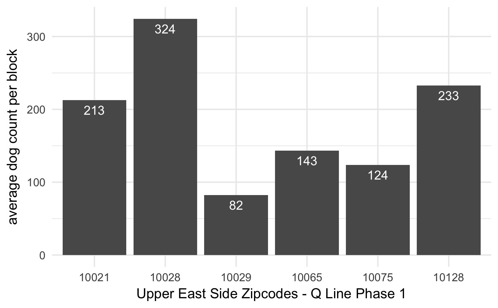

```{r setup, include=FALSE}
knitr::opts_chunk$set(warning = FALSE,
                      message = FALSE, 
                      cache = TRUE)
```

## Executive Summary

How does the New York City Second Ave Subway Line project influence the Upper East Side? 

To answer this question, we planned to explore the impacts holistically from an economical and social perspective. However, limited by the datasets that are available to us, we decided to focus mainly on the economical impacts by looking at datasets including Building Permits, Real Estate Sales, Property Market Values, Property Assessed Values, and Dogs Licensing data as a bonus. 

In our findings, we will present to you: <br>
1) Where are the new buildings coming out in this area <br>
2) Building permits patterns <br>
3) Real estate price patterns <br>
4) Where to spot the cutest puppies on the Upper East Side <br> 

### How we started

We designed several metrics below to analyze how the addition of a new subway line may impact a neighborhood economically: <br>
1) Explore how the property price changes along the subway line <br>
2) Explore how the quantity of building activities changes as the subway line is planned, constructed, and completed <br>
3) Compare the differences in the dog quantity between UES Q Line extension area with another neighborhood without a new subway line constructed  <br>

Some of our findings are very surprising, some pleasantly intriguing, while others met our expectations. 
 

### Findings: Phase 1 

In the Phase 1 construction of the Q line, as shown below, we can see where the new line and stations are located on the Upper East Side.


#### *Building Permits*

Overall, the count of building permits issued were more or less constant with a dip in 2008 due to the economic crisis.

The closer the block is to the Second Avenue Subway line, the more building permits were issued. However, when we look down to the block level, we do notice that there has been a spike in 2015, which was right before the Q line opened, for blocks that are one block west of the subway line, while all the permits issued dropped for the other blocks in that same here. This seems to indicate that the line is affecting neighboring permit issuance.


For areas to the east of the Second Avenue line, the number of permits issued grows at a faster rate. However, it is inconclusive to attribute this growth solely to the Q Line, since the area has a higher growth historically. We think the root of this phenomenon could be the close proximity to the water, which makes the area more attractive to different types of constructions. 


For more details, please look at the [EDA-Building Permits](EDA-Building Permits.html)!

#### *Real Estate Sales*

In terms of real estate sales, we believe there’s a lag of the effects compared to the building permits. Building permits are a better representation of what happens before a project is built, while real estate sales are a better representation of what happens later.

From our observations below for blocks left of the Second Avenue line, we can see that there’s an infection point in 2017, which was when the subway line opened. We cannot pinpoint down to the exact reason, but we can see that the average price has increased since 2017 for areas one block east of the subway line, while areas that are 2-3 blocks or 4-5 blocks have fallen at a more drastic rate. This seems to indicate that, however minimally, that the subway line is changing the residential pattern on the Upper East Side.


Similar to the building permits, the effects of the subway addition is more drastic on blocks east of the Second Avenue line. We can see in the graph below that the average price for sales that are two blocks east from the line has fallen much drastically since 2017, while average prices for one block east have surpassed sales price of properties 3-4 blocks away. As for the high prices of 3-4 blocks on the east side, we think it attributes to the location which it has a close proximity to the water.


#### *Property Market Values/Property Assessed Value*

Property market and assessed value are often explained by the sales price of real estate. Therefore, we are not going to talk about it here. 

For more information, please look under the [EDA-Property Market Values](EDA-Property Market Values.html) and [EDA-Property Assessed Values](EDA-Property Assessed Values.html). 

### Phase 2

As the second phase of the subway line is still in the planning, the observations are rather ambiguous in comparison to the results we saw from phase 1. However, we can still see there have been some activities going on since the opening of Phase 1 and our discovery is mostly consistent with phase 1. 


#### *Building Permits*

Because the Second Avenue line does not go in a straight line, we adopted a combination of radius measurement (for when the line turns), and discrete block measurement (for when the subway still goes in a line). From the chart below, we can see that areas within one block radius from the station has been having more permits filed despite that the areas within two block radius used to be a leading contender. Moreover, the  counts of building permits stayed low for areas two blocks right off the subway line compared to the other locations in recent years.


#### *Real Estate Sales*

As for real estate sales, it doesn't seem like the prices have caught up with the Phase 2 trends. As shown below, all average sale prices have been at its all time low since 2014 despite the building of the Second Avenue line. Also, because there's a lag compared to the permits, we think that real estate sales trend would be more defined once the permits pattern stabilizes. 


#### *Our Furry Friends*

Last but not the least, let’s see where we can find our cute furry friends on Upper East Side! We found out that, zipcode 10028, which covers streets from 81 to 86th street has the highest number of dogs per block, which means getting off the 86th street on the Q line, your chances of meeting a cute dog is maximized!!



We find out that from a gender perspective, female dogs and male dogs are at around the same quantity, male dogs holding a small lead. If you like small dogs, Upper East Side is a great place to spot some cute Shih Tzu and Yorkshire Terriers. 

 


