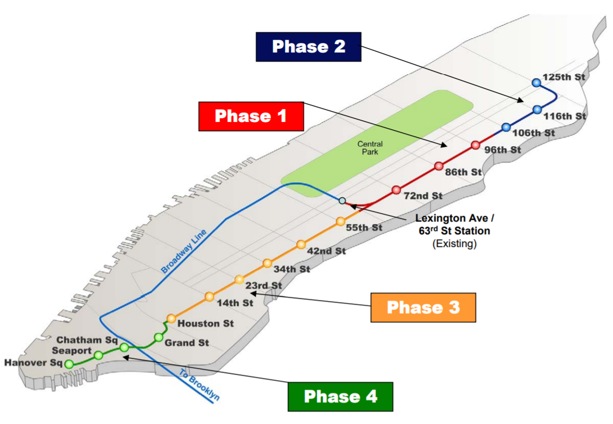

---
output:
  html_document:
    df_print: paged
  pdf_document: default
pagetitle: EDAV Project - Introduction
---

## Introduction

The main question we are interested in studying is, if the $17 Billion Dollars and 100 years long New York City 2nd Ave Line subway project is positively affecting the economical development of upper east side? _(Note: I just included 'economical', not sure if we did any analysys for 'social' development?)_

To answer our main (and ambitious) question, our strategy was to develop different analysis to answer smaller questions including, whether the project has positively influenced the following economical aspects in it's inmediate area of influence: 

* Remodeling of existing and construction of new, buildings
* Real State Sales
* Property Market Values
* . _please add other analysis performed here_

### Why we chose this topic
_Jason/Sharon, please help here_ Overbudget and overdue, the 2nd Ave Subway is one of the most ambitious transportation development projects in NYC. We wanted to assess whether the wait and money spent on planning and constructing the subway was put to good use.
  
  
### The Team

* Addison Li (yl3870): _Addison please add here_
* Andres Rios (dar2196): Building permits (EDA & interactive map), Property Market Values
* Jason Kuo (jk4097): Strategic question, Mapping Real State Sales... _Jason please add more here_
* Sharon Tsao (sjt2141): Real State Sales _Sharon please add more here (Great Cookies)_
  
  
### Project Background
  

Image from: http://www.apta.com/previousmc/multimodal/previous/2010/Presentations/Planning-for-the-Second-Avenue-Subway-From-Dream-to.pdf
 

The Second Avenue Subway, a New York City Subway line that runs under Second Avenue on the East Side of Manhattan, has been proposed since 1920. The first phase of the line, consisting of three stations on the Upper East Side, started construction in 2007 and opened in 2017, ninety-seven years after the route was first proposed. Up until the 1960s, many distinct plans for the Second Avenue subway line were never carried out, though small segments were built in the 1970s. The complex reasons for these delays are why the line is sometimes called "the line that time forgot" (source: Wikipedia).

A brief summary of more important milestones is:

* 1919: original proposal.   
* 1942 - 1956: Parallel elevated lines along Second Avenue and Third Avenue were demolished  
* 1960: Increase in development on East Side, existing Lexington Avenue Line became overcrowded.  
* 1967: voters approved a Transportation Bond Issue, which provided over $600 million (worth $4,404,000,000 today) for New York City projects. The City secured a $25 million Urban Mass Transportation Act (UMTA) grant for initial construction.  
* 1972: Construction on the line finally began   
* 1975: Initial construction was halted because of the NY city's fiscal crisis, tunnels sealed later. 
* 1999: MTA Study proposed new subway service from 63rd Street north up Second Avenue to 125th Street.
* 2000: MTA Capital Program Review Board approved the MTA's 2000-2004 Capital Program, which allocated $1.05 billion for the construction of the 2nd Avenue Line.  
* 2001: the Federal Transit Administration approved the start of preliminary engineering on a full-length 2nd Ave Line.  
* 2004: Approval of MTA's environmental impact statement (FEIS) proposing a two-track line from 125th Street and Lexington Avenue in Harlem, down Second Avenue to Hanover Square in the Financial District to be build in 4 phases:  
  + Phase 1 rerouted the Q service via the BMT 63rd Street Line and north along Second Avenue, to the   Upper East Side at 96th Street. 
  + Phase 2 will extend the rerouted Q train to 125th Street and Lexington Avenue.   
  + Phase Three, will run from 125th Street to Houston Street.   
  + Phase will extend service from Houston Street to Hanover Square in Lower Manhattan.  
  
__Phase 1 only:__  

* 2005: Voters passed a transportation bond issue on November 8, 2005, allowing for dedicated funding allocated for phase 1.  
* 2006: United States Department of Transportation (USDOT) agave $1.3 billion in federal funding for the phase 1, to be funded over a seven-year period. Preliminary engineering and a final tunnel design was completed.  
* 2007: Final Phase 1 construction started.  
* 2017: after several news about progress and delays, phase 1 finally opened on Jan 1st. This phase 1 consisting of the 96th Street, 86th Street, and 72nd Street stations and two miles (3.2 km) of tunnel, had a cost of $4.45 billion.

__Phase 2 only:__  

* 2015: phase 2 was allocated $535 million in the MTA's 2015-2019 Capital Plan for planning, design, environmental studies, and utility relocation.  
* 2016: In March, MTA began advertising Requests for Proposals (RFP) for three new contracts for phase 2. In April 2016, the MTA and the State of New York reached a deal to restore funding to Phase 2, with a total of $1.035 billion allocated. On May 24, 2017, the MTA Board increased funding for Phase 2 to $1.735 billion.  
* 2017: by August 2017, preliminary work on the line was underway, and the engineering firm AKRF was updating the environmental impact study for Phase 2. 

__Phases 3 and 4:__  

* Phases 3 and 4 have no funding commitments yet.  